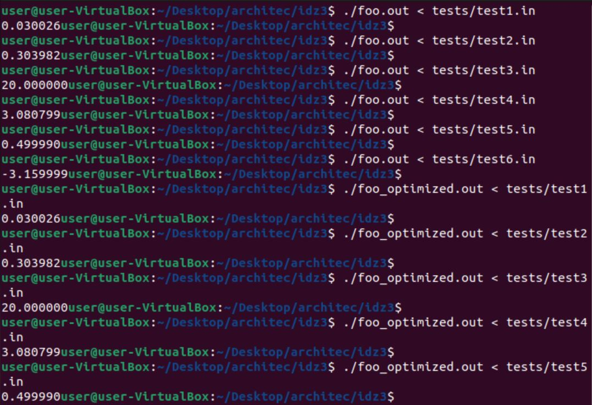
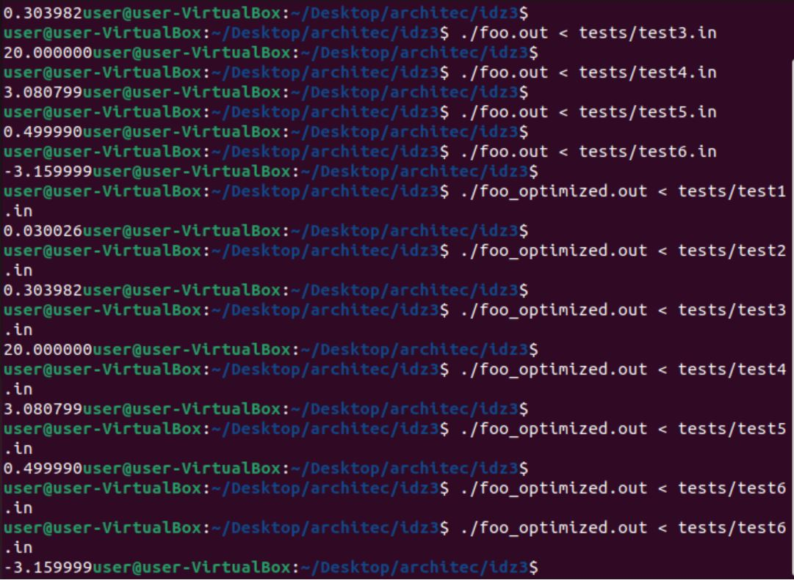
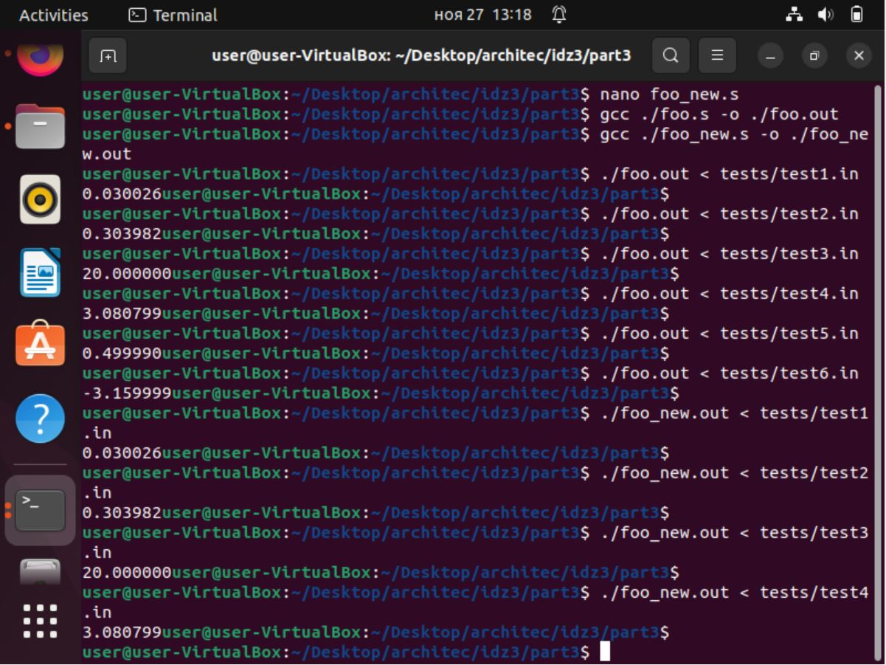
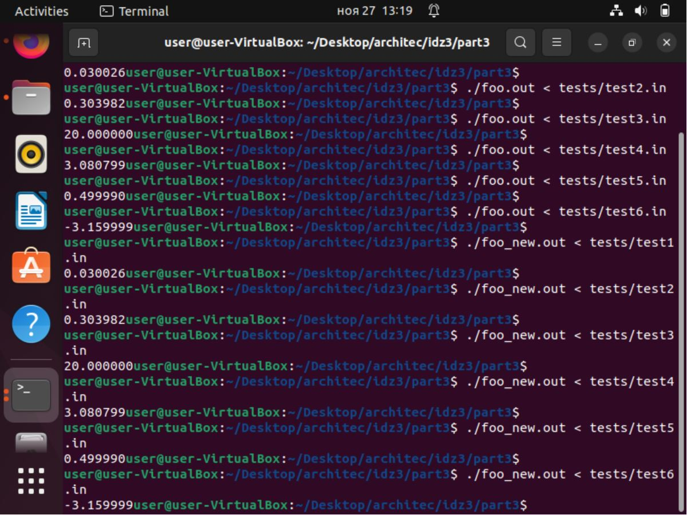
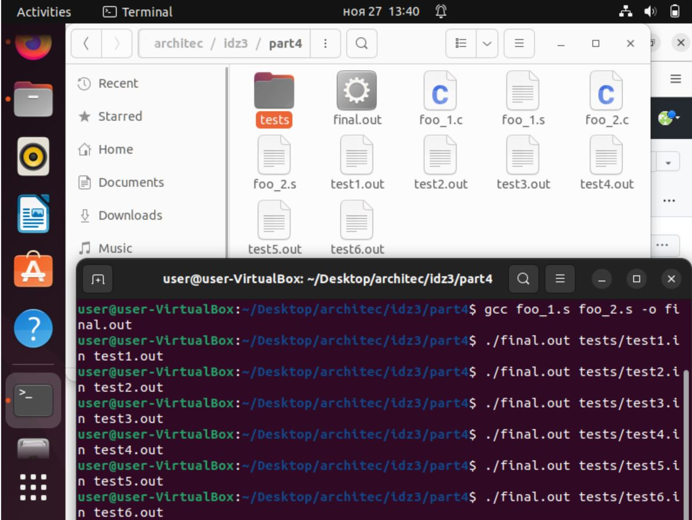
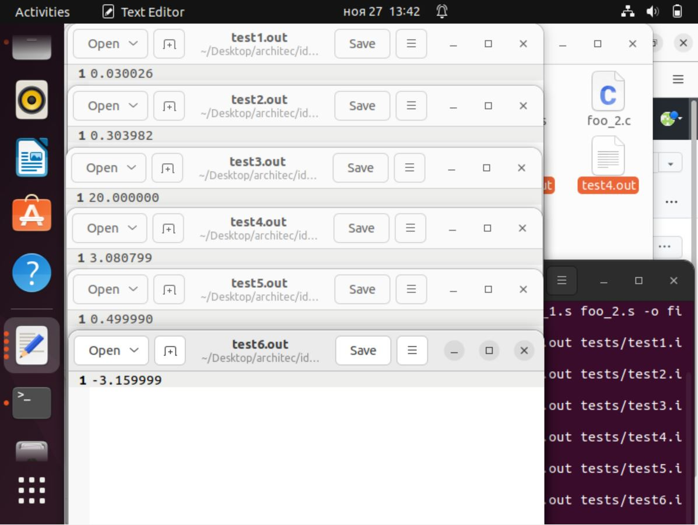

*ИДЗ № 3*
**Багрянский Константин Дмитриевчи БПИ 218**  
**Вариант №31**
Разработать программу численного интегрирования функции y =
a + b ∗ x^3
(задаётся действительными числами а,b) в определённом диапазоне целых (задаётся так же) методом прямоугольников
с недостатком (точность вычислений = 0.0001).

*Оценка 4*  **папка part1**  
Файл foo.c - решение на языке C.  
Файл foo.s скомпилирован с флагом -masm=intel  (Добавлены комментарии)  
Файл foo_optimized.s скопилирован с флагами -masm=intel -fno-asynchronous-unwind-tables -fno-jump-tables -fno-stack-protector -fno-exceptions  
Файл foo_optimized.s отдельно откомпилирован и скомпонован.  

Полное тестовое покрытие программ (part1/tests): 
Тест 1:  
0.3 1.1 0 0.1 100  
Результаты:    
foo.out:            0.030026   
foo_optimized.out:  0.030026  
Точное              0.030027  
Отклонение менее    0.0001  

Тест 2:  
1 1 -0.8 -0.4 10000  
Результаты:    
foo.out:            0.303982   
foo_optimized.out:  0.303982  
Точное              0.304  
Отклонение менее    0.0001   

Тест 3:  
1 0 -10 10 10000  
Результаты:    
foo.out:            20.0   
foo_optimized.out:  20.0  
Точное              20.0  
Отклонение менее    0.0001  

Тест 4:  
3.4 2.2 0.1 0.9 1000000  
Результаты:    
foo.out:            3.080799   
foo_optimized.out:  3.080799  
Точное              3.0808  
Отклонение менее    0.0001  

Тест 5:  
1 2 -1 0 100000  
Результаты:    
foo.out:            0.499990   
foo_optimized.out:  0.499990  
Точное              0.5  
Отклонение менее    0.0001  

Тест 6:  
-2.8 -1.44 0 1 1000000  
Результаты:    
foo.out:            -3.159999   
foo_optimized.out:  -3.159999  
Точное              -3.16  
Отклонение менее    0.0001  

Вывод: программы работают одинаково на всех тестах.  Отклонение на каждом их тестов менее 0.0001

*Оценка 5*  **папка part2**   
Переделано решение на C. Добавлены функции с передачей данных через параметры. В функциях использованы локальные переменные.  

Файл foo.c:  
double integral(double a, double  b, double l, double r, int n) вычисляет интеграл
Файл foo.s:
Скомпилирован с флагами -masm=intel -fno-asynchronous-unwind-tables -fno-jump-tables -fno-stack-protector -fno-exceptions  
В ассемблерный код добавлены комментарии описывающие передачу параметров и перенос возращаемого результата, показывающие связь языка C и ассемблера.

*Оценка 6*  *папка part3*  
Была произведена переработка программы part2/foo.s за счёт использования максимального числа регистров  
Так же были добавлены комментарии поясняющие эквивалентные использования переменных в C
С результатом можно ознакомится в part3/foo_new.s
Так же полное тестовое покрытие (все тесты лежат в part1/tests):

Тест 1:  
0.3 1.1 0 0.1 100  
Результаты:    
foo.out:            0.030026   
foo_new.out:  0.030026  
Точное              0.030027  
Отклонение менее    0.0001  

Тест 2:  
1 1 -0.8 -0.4 10000  
Результаты:    
foo.out:            0.303982   
foo_new.out:        0.303982  
Точное              0.304  
Отклонение менее    0.0001   

Тест 3:  
1 0 -10 10 10000  
Результаты:    
foo.out:            20.0   
foo_new.out:        20.0  
Точное              20.0  
Отклонение менее    0.0001  

Тест 4:  
3.4 2.2 0.1 0.9 1000000  
Результаты:    
foo.out:            3.080799   
foo_new.out:        3.080799  
Точное              3.0808  
Отклонение менее    0.0001  

Тест 5:  
1 2 -1 0 100000  
Результаты:    
foo.out:            0.499990   
foo_new.out:        0.499990  
Точное              0.5  
Отклонение менее    0.0001  

Тест 6:  
-2.8 -1.44 0 1 1000000  
Результаты:    
foo.out:            -3.159999   
foo_new.out:        -3.159999  
Точное              -3.16  
Отклонение менее    0.0001  

Вывод: программы работают одинаково на всех тестах.  

*Оценка 7*  *папка part4*  
Была произведена переработка программы.  
Аргументами командной строки задаются входной и выходный файлы.  
Программа была разбита на 2 единицы компиляции foo_1.s и foo_2.s  
На скриншоте можно видеть компиляцию двух файлов в один final.out  
Так же на следущем скриншоте видно, что запись в файл работает корректно, так же как и работа программы.  

